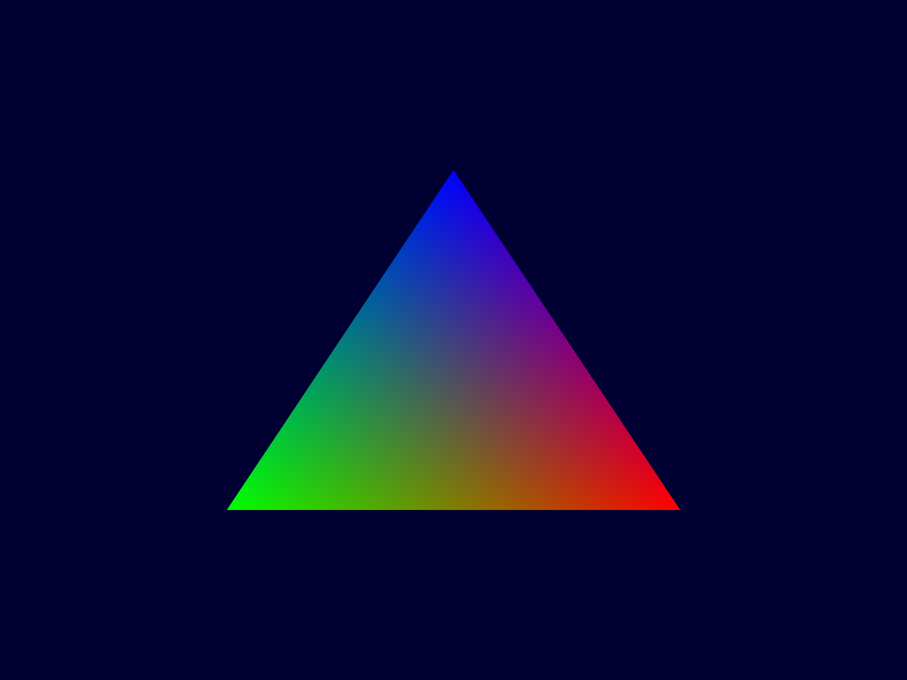

# Minimal Screenshot Example with Vulkan on macOS

The purpose of this project is to demonstrate a possible regression that was introduced between `vulkansdk-macos-1.2.141.2` and `vulkansdk-macos-1.2.148.0` where a screenshot taken using `vkCmdCopyImage` will result in an image of only black pixels. 

This repository uses the code from [Sascha Willems' Vulkan Examples](https://github.com/SaschaWillems/Vulkan) to draw a triangle and provide screenshot functionality. The code has been reduced to provide a minimally reproducible example.

## Usage

Set up the Vulkan SDK as described in the LunarG documentation under the section "[Set up the runtime environment manually](https://vulkan.lunarg.com/doc/sdk/1.2.148.1/mac/getting_started.html)".

Clone and build the repository:

```
$ git clone https://github.com/andystanton/vk-macos-minimal-screenshot.git --recursive
$ cd vk-macos-minimal-screenshot
$ make
$ open cmake-build-debug
```

Then from the Finder window that opens:

1. Run `screenshot.app`.
2. Push `p` to take a screenshot.
3. Open `screenshot.ppm`

If your build environment used SDK 1.2.141.2, then you should see this:



If your build environment used SDK 1.2.148.0 or later, then you should see this:


## Caveats

* It's important to run the built macOS app from Finder rather than using `open cmake-build-debug/screenshot.app` because it seems that the Vulkan shell environment variables will be used to link the Vulkan library in preference to the one bundled with the app. Using Finder ensures no shell environment variables are available.
* The project uses CMake rather than Xcode to build a minimal macOS Vulkan app. The assembly of the app is probably not the recommended way to do this - either by MoltenVK or CMake standards, but it does work. A similar approach is used in the Khronos [Vulkan-Tools macOS Cube example](https://github.com/KhronosGroup/Vulkan-Tools/blob/master/cube/macOS/cubepp/cubepp.cmake).
* The build can sometimes stall for a few minutes after the last step, displaying '[100%] Built target screenshot'. I don't know why this is, but rather than waiting, you can kill the process with `ctrl-c` and run the application which will have already been successfully built. 
